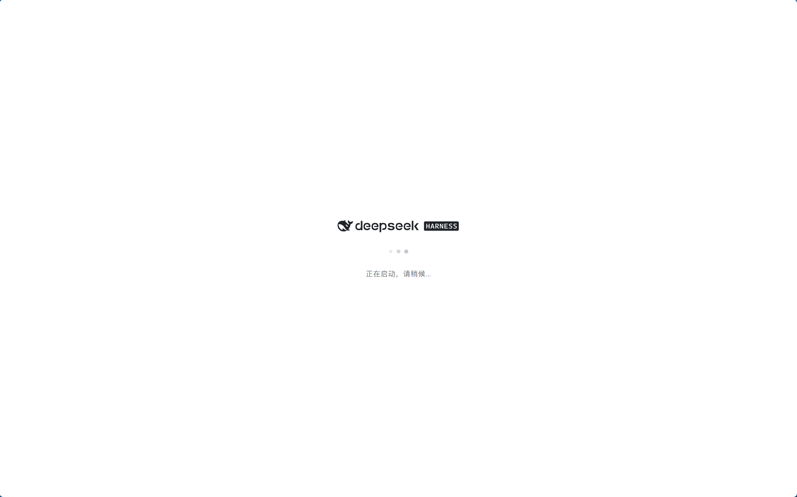
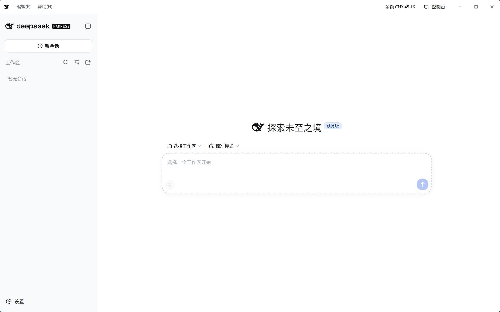
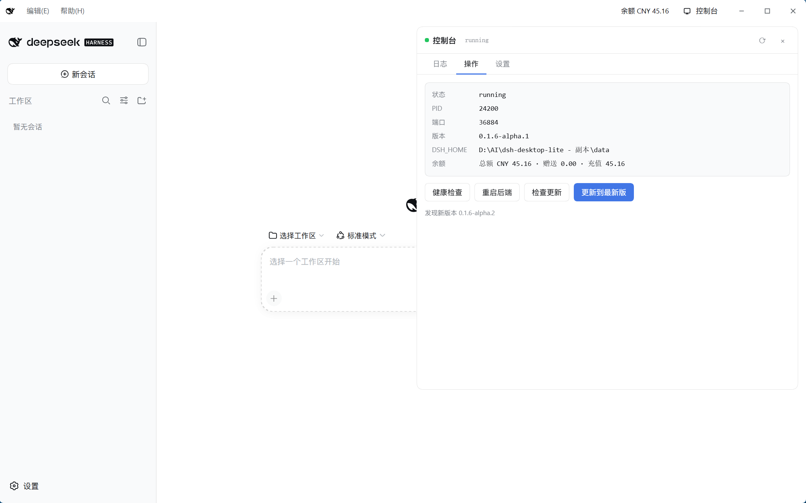
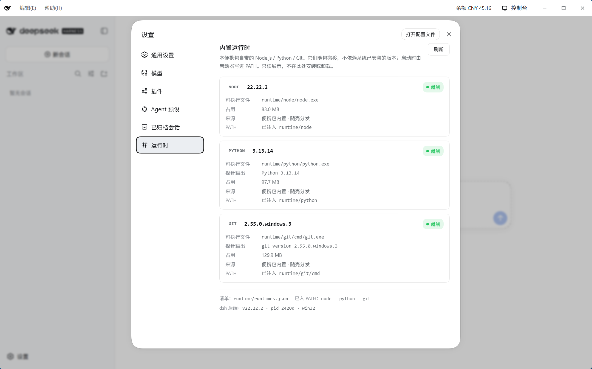
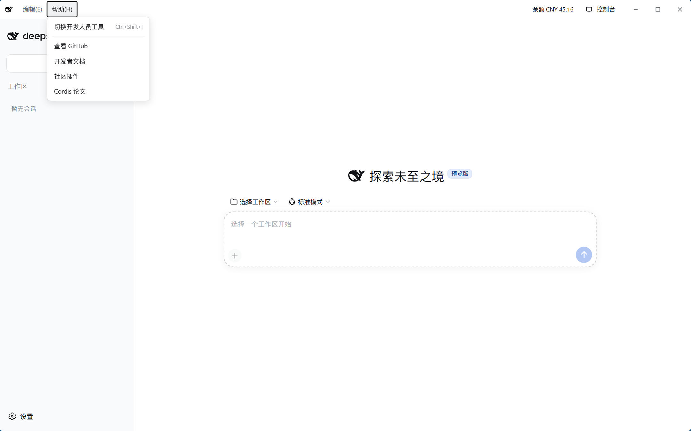
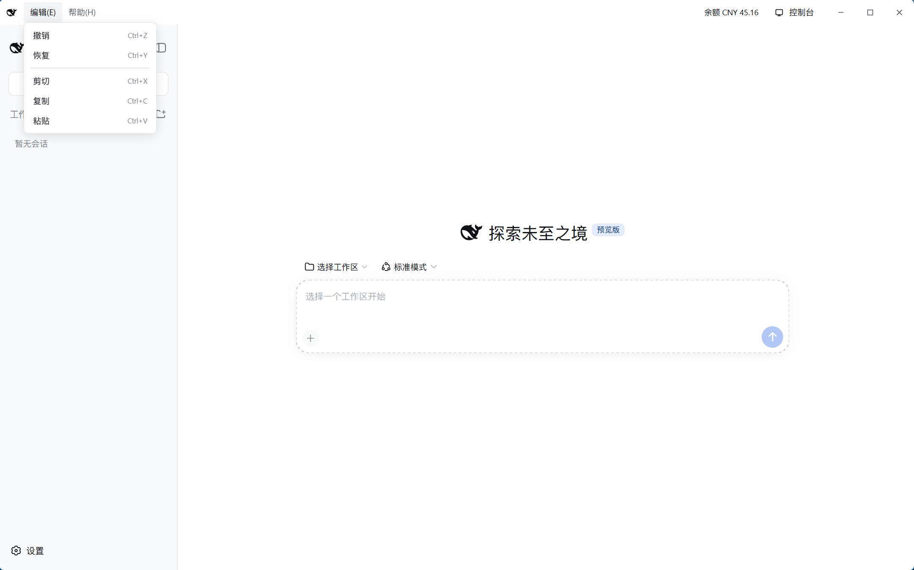

<p align="center">
  
</p>

<h3 align="center">DeepSeek Harness Desktop Lite</h3>

<p align="center">
  <b>中文</b> · <a href="#english">English</a>
</p>

<p align="center">双击即用的 AI Agent 工作台 — 基于 <a href="https://github.com/Ringlingo/deepseek-harness">DeepSeek Harness</a> 的便携桌面客户端</p>

<p align="center">
  <a href="#下载">下载</a> ·
  <a href="#截图">截图</a> ·
  <a href="#功能特性">功能</a> ·
  <a href="#便携性">便携性</a> ·
  <a href="#从源码构建">构建</a> ·
  <a href="#维护与发布工具">工具</a> ·
  <a href="#目录结构">目录</a>
</p>

---

## 下载

从 [GitHub Releases](../../releases) 下载最新的 `dsh-desktop-lite-vX.X.X.zip`（约 **356 MB**），
解压到任意目录，双击 `dsh-desktop-lite.exe` 即可。

**无需安装 Node.js / Python / Git，无需配置环境** —— 三者都随包携带。

> 首次在**新路径**上启动时，dsh 会重建一次内部镜像（约十几秒），属正常现象，见 [便携性](#便携性)。

## 截图

| 启动加载 | 主界面 | 控制台（状态 / 日志 / 更新） |
|:---:|:---:|:---:|
|  |  |  |

| 设置 · 内置运行时 | 帮助菜单 | 编辑菜单 |
|:---:|:---:|:---:|
|  |  |  |

## 功能特性

### 开箱即用

- **双击即用** — 内嵌 Node.js / Python / Git 与 DSH 运行时，零依赖
- **便携部署** — 整个目录拷到任意 Windows 机器即可用，数据随目录走
- **自动启动** — 双击 exe 自动拉起 DSH 后端并进入工作台，无需手动开服务

### 内置运行时可视化

设置 → **运行时** 页会列出包内自带的三个运行时（Node.js / Python / Git）：
可执行文件路径、版本（实际探针输出）、占用体积、是否已注入 `PATH`。
数据来自 `runtime/runtimes.json`，只读展示，不在此处安装或卸载。

### 标题栏与菜单

- **自定义标题栏** — 鲸鱼图标 + 编辑/帮助下拉菜单 + 余额显示 + 控制台入口
- **编辑菜单** — 撤销、恢复、剪切、复制、粘贴（Ctrl 快捷键）
- **帮助菜单** — 开发者工具、GitHub、开发者文档、社区插件、Cordis 论文
- **窗口控制** — 最小化、最大化、关闭（拖拽标题栏移动；点关闭**最小化到托盘**而非退出）

### 后端管理（控制台）

- **日志** — 后端 stdout/stderr 实时流，支持导出 / 清空 / 暂停
- **操作** — 健康检查（端口连通 + 服务握手）、重启后端、检查更新、**更新到最新版**
- **设置** — 面板与 provider 相关开关
- **进程信息** — 状态、PID、端口、版本、`DSH_HOME`、余额明细

### 数据与安全

- **数据隔离** — 所有数据在包内 `data/` 目录，不污染用户主目录
- **DSH_HOME 注入** — 由启动器强制注入，禁止回落到 `~/.dsh`
- **凭据仅用于 HTTPS 请求头** — 不写日志、不随错误信息外泄

### 主题与适配

- **主题跟随** — 标题栏自动适配 DSH 深色/浅色主题
- **图标自适应** — 浅色模式黑色图标，深色模式自动反白

## 便携性

这是本项目与普通 Electron/Tauri 打包方式**最大的不同**，也是踩坑最多的地方：

- **镜像用 dsh 原生「代理目录」，不使用 junction / symlink**
  包内 `data/profiles/node_modules/` 下的 400+ 个依赖条目都是**真实目录**（含 `package.json` +
  `dsh.moduleFallback` 目标表 + `entry-N.js`）。因此：

  | 场景 | 结果 |
  | --- | --- |
  | 压缩 / 解压（ZIP） | **无损** —— 没有链接可被"摊平" |
  | 网盘同步、GUI 跨盘复制 | 同上，条目不会被物化 |
  | 换机器 / 换路径 | 首次启动由 dsh 自动重建镜像；**不需要建链接权限**（受限环境也能用） |
  | 受限账户 / 无开发者模式 | 可正常启动（旧方案在此时必然失败） |

- **启动自检**（`scripts/startup-selfcheck.mjs`，编译期内嵌进 exe）
  每次启动前检查：物化条目、悬空链接、孤儿锁、清单一致性。**认代理目录**，不会误判；写失败时
  **fail-open**（回落磁盘副本）而不是阻断启动。

- **换路径后的首次启动会重建镜像**：代理条目里存的是绝对路径，路径变了就失效 ⇒ dsh 全量重建。
  后端启动超时已放宽到 **300 s** 以覆盖慢盘。

## 系统要求

- **操作系统**：Windows 10 1809+ / Windows 11 x64
- **WebView2 Runtime**：Windows 10 1809+ 已自带，无需额外安装

## 从源码构建

### 前置要求

- [Rust](https://rustup.rs) 1.77+（MSVC 工具链）
- 一份可用的 DSH 运行时（`runtime/node/` + `runtime/dsh/`）

### 编译壳

```powershell
cd src-tauri
cargo build --release --locked
# 产物：src-tauri/target/release/dsh-portable.exe
```

> ⚠️ 改过 `ui/index.html` 之后，**必须先 `touch src-tauri/build.rs` 再编译**，
> 否则 cargo 只做秒级"假编译"，前端资源不会重新内嵌。

### 组装完整包

```powershell
cd ..            # 回到仓库根
.\scripts\build-release.ps1
```

产物在 `release/dsh-desktop-lite/`。

## 维护与发布工具

| 工具 | 用途 |
| --- | --- |
| `tools/check-dsh-patches.mjs` | **换包体检**：11 项只读检查，确认可移植性补丁是否都还在位（缺哪项就指向文档哪一节） |
| `docs/APPLY-ON-NEW-PACKAGE.md` | **换包/升级后的恢复清单** —— 哪些修复不在源码树里、怎么逐项恢复 |
| `docs/fix-plan-2026-09-16.md` | 可移植性问题的完整根因与实测证据（问题史） |
| `scripts/build-release.ps1` | 编译 exe + 组装完整便携包 |
| `scripts/push-to-github.ps1` | 一键推送到 GitHub（默认保留远端历史，`-Fresh` 覆盖） |
| `scripts/make-release.ps1` | 脱敏 → 打干净 zip → 核对内容 →（可选）创建 GitHub Release |

换包后建议先跑一次体检：

```powershell
runtime\node\node.exe tools\check-dsh-patches.mjs --root .
```

> ⚠️ 含中文的 `.ps1` **必须存为 UTF-8 with BOM**，否则 Windows PowerShell 5.1 会按 GBK 解码并报假语法错误。
> 详见 `docs/APPLY-ON-NEW-PACKAGE.md` §7。

## 目录结构

```
dsh-desktop-lite/
├── dsh-desktop-lite.exe         # 壳程序（约 13 MB，含内嵌加载页与启动自检脚本）
├── ui/index.html                # 启动加载页
├── runtime/                     # 随包携带的运行时（约 535 MB）
│   ├── node/node.exe            #   Node.js 22（83 MB）
│   ├── python/                  #   Python 3.13（98 MB）
│   ├── git/                     #   PortableGit 2.55（130 MB）
│   ├── runtimes.json            #   运行时清单（运行时页读取）
│   └── dsh/                     #   DeepSeek Harness 核心（213 MB）
├── data/                        # 用户数据（首次运行自动创建）
│   ├── profiles/                #   配置 + 依赖镜像（约 411 个代理目录，13 MB）
│   ├── plugins/                 #   随包携带的外挂插件
│   ├── sessions/ storages/ logs/
│   ├── settings.yaml
│   └── .credentials.yaml        #   API 凭据（发布前务必删除）
└── _tools/                      # 维护脚本（自检 / 装插件 / 剥冗余 / 升级）
```

**整包大小**：约 **561 MB**（含全部运行时）；打完 zip 约 **356 MB**。

## 技术栈

| 层级 | 技术 |
|------|------|
| 壳 | [Tauri 2](https://tauri.app/)（Rust） |
| 前端 | HTML/CSS/JS 注入（基于 DSH Web UI） |
| 后端 | [DeepSeek Harness](https://github.com/Ringlingo/deepseek-harness)（Node.js + Cordis） |
| 运行时 | Node.js 22 · Python 3.13 · Git 2.55（均随包携带） |

## 质量红线

| # | 红线 |
|---|------|
| R1 | WebView 必须加载 `http://127.0.0.1:PORT` 同源 URL |
| R2 | DSH_HOME 必须指向包内 `data/`，禁止回落 `~/.dsh` |
| R3 | 退出必须杀干净子进程树 |
| R4 | 版本号从 package.json 读取，不用 `host.describe().version` |
| R5 | 更新必须 SHA256 校验 + 原子替换 + 回滚 |
| R6 | 更新过程不阻塞 UI |
| R7 | 日志不输出敏感信息 |
| R8 | 单实例，不重复启动后端 |
| R9 | 无裸崩溃，统一错误 UI |
| R10 | 启动就绪行解析严格匹配 |
| R11 | 余额凭据仅用于 HTTPS 请求头 |
| R12 | 可移植性补丁必须能被 `tools/check-dsh-patches.mjs` 全部验证通过 |

## 相关项目

- [DeepSeek Harness](https://github.com/Ringlingo/deepseek-harness) — Agent 工具核心
- [Cordis](https://github.com/cordiverse/cordis) — 插件框架
- [Tauri](https://tauri.app/) — 桌面应用框架

## 许可证

[MIT](LICENSE)

---

<a id="english"></a>

# DSH Desktop

<p align="center">
  <b>English</b> · <a href="#">中文</a>
</p>

<p align="center">A portable desktop client for <a href="https://github.com/Ringlingo/deepseek-harness">DeepSeek Harness</a> — double-click to launch your AI Agent workspace</p>

<p align="center">
  <a href="#download">Download</a> ·
  <a href="#screenshots">Screenshots</a> ·
  <a href="#features">Features</a> ·
  <a href="#portability">Portability</a> ·
  <a href="#build-from-source">Build</a> ·
  <a href="#maintenance--release-tooling">Tooling</a> ·
  <a href="#directory-structure">Structure</a>
</p>

---

## Download

Download the latest `dsh-desktop-lite-vX.X.X.zip` (~**356 MB**) from [GitHub Releases](../../releases),
extract it anywhere, and double-click `dsh-desktop-lite.exe`.

**No Node.js / Python / Git installation, no environment setup** — all three ship inside the package.

> On the **first launch from a new path**, dsh rebuilds its internal mirror once (a few seconds). This is expected — see [Portability](#portability).

## Screenshots

| Splash | Main UI | Console (status / logs / update) |
|:---:|:---:|:---:|
|  |  |  |

| Settings · Bundled runtimes | Help menu | Edit menu |
|:---:|:---:|:---:|
|  |  |  |

## Features

### Out of the box

- **Zero-config launch** — embedded Node.js / Python / Git + DSH runtime, nothing to install
- **Portable deployment** — copy the whole directory to any Windows machine; data travels with it
- **Auto-start** — the exe launches the DSH backend and enters the workspace for you

### Bundled runtimes, made visible

Settings → **Runtime** lists the three runtimes shipped in the package (Node.js / Python / Git):
executable path, probed version, disk usage, and whether it was injected into `PATH`.
Data comes from `runtime/runtimes.json`; read-only, nothing is installed or removed here.

### Title bar & menus

- **Custom title bar** — whale logo + Edit/Help dropdowns + balance + console entry
- **Edit menu** — Undo, Redo, Cut, Copy, Paste (Ctrl shortcuts)
- **Help menu** — DevTools, GitHub, developer docs, community plugins, Cordis paper
- **Window controls** — minimize, maximize, close (drag to move; close **minimizes to tray** instead of quitting)

### Backend management (console)

- **Logs** — live backend stdout/stderr with export / clear / pause
- **Operations** — health check (port + handshake), restart backend, check for updates, **update to latest**
- **Settings** — panel and provider switches
- **Process info** — status, PID, port, version, `DSH_HOME`, balance breakdown

### Data & security

- **Data isolation** — everything lives in the package's `data/` directory, never the user home
- **DSH_HOME injection** — forced by the launcher; no fallback to `~/.dsh`
- **Credentials only in HTTPS headers** — never logged, never leaked in errors

### Theme adaptation

- **Theme following** — title bar adapts to the DSH dark/light theme
- **Icon adaptation** — black icon in light mode, auto-inverted in dark mode

## Portability

This is where the project differs most from a plain Electron/Tauri bundle — and where most of the hard lessons came from:

- **The mirror uses dsh's native "proxy directories" — no junctions, no symlinks.**
  Every one of the 400+ dependency entries under `data/profiles/node_modules/` is a **real directory**
  (a `package.json` with a `dsh.moduleFallback` target table plus `entry-N.js`). Consequences:

  | Scenario | Result |
  | --- | --- |
  | ZIP compress / extract | **Lossless** — there are no links to be flattened |
  | Cloud-sync, GUI cross-drive copy | Same; entries are not materialized |
  | New machine / new path | The mirror is rebuilt by dsh on first launch; **no link-creation privilege needed** |
  | Restricted account / no Developer Mode | Works (the old junction-based design could not) |

- **Startup self-check** (`scripts/startup-selfcheck.mjs`, embedded into the exe at compile time)
  Before every launch it verifies materialized entries, dangling links, orphan locks and manifest
  consistency. It **recognizes proxy directories** (no false positives) and **fails open** on write
  errors (falling back to the on-disk copy) instead of blocking startup.

- **The first launch after a path change rebuilds the mirror**: proxy entries store absolute targets,
  so a moved package invalidates them and dsh rebuilds the whole set. The backend start timeout has been
  raised to **300 s** to cover slow disks.

## System Requirements

- **OS**: Windows 10 1809+ / Windows 11 x64
- **WebView2 Runtime**: pre-installed on Windows 10 1809+, no extra install needed

## Build from Source

### Prerequisites

- [Rust](https://rustup.rs) 1.77+ (MSVC toolchain)
- A working DSH runtime (`runtime/node/` + `runtime/dsh/`)

### Build the shell

```powershell
cd src-tauri
cargo build --release --locked
# artifact: src-tauri/target/release/dsh-portable.exe
```

> ⚠️ After editing `ui/index.html`, you **must `touch src-tauri/build.rs` before building**,
> or cargo performs a sub-second no-op build and the frontend assets are never re-embedded.

### Assemble the full package

```powershell
cd ..            # back to repo root
.\scripts\build-release.ps1
```

Output lands in `release/dsh-desktop-lite/`.

## Maintenance & release tooling

| Tool | Purpose |
| --- | --- |
| `tools/check-dsh-patches.mjs` | **Package health check**: 11 read-only checks that every portability patch is still in place, each pointing at the matching doc section |
| `docs/APPLY-ON-NEW-PACKAGE.md` | **Recovery checklist** for a new upstream package — which fixes live outside the source tree and how to restore each one |
| `docs/fix-plan-2026-09-16.md` | Full root-cause history of the portability work, with measurements |
| `scripts/build-release.ps1` | Build the exe and assemble the full portable package |
| `scripts/push-to-github.ps1` | One-command push (preserves remote history; `-Fresh` overwrites) |
| `scripts/make-release.ps1` | Desensitize → build a clean zip → verify contents → (optionally) create a GitHub Release |

Run the health check after swapping in a new upstream package:

```powershell
runtime\node\node.exe tools\check-dsh-patches.mjs --root .
```

> ⚠️ A `.ps1` containing non-ASCII text **must be saved as UTF-8 with BOM**; otherwise Windows
> PowerShell 5.1 decodes it as GBK and reports bogus syntax errors. See `docs/APPLY-ON-NEW-PACKAGE.md` §7.

## Directory Structure

```
dsh-desktop-lite/
├── dsh-desktop-lite.exe         # Shell (~13 MB, with embedded splash page and self-check script)
├── ui/index.html                # Splash / loading page
├── runtime/                     # Bundled runtimes (~535 MB)
│   ├── node/node.exe            #   Node.js 22 (83 MB)
│   ├── python/                  #   Python 3.13 (98 MB)
│   ├── git/                     #   PortableGit 2.55 (130 MB)
│   ├── runtimes.json            #   Runtime manifest (read by the Runtime settings page)
│   └── dsh/                     #   DeepSeek Harness core (213 MB)
├── data/                        # User data (created on first run)
│   ├── profiles/                #   Config + dependency mirror (~411 proxy dirs, 13 MB)
│   ├── plugins/                 #   Bundled out-of-tree plugins
│   ├── sessions/ storages/ logs/
│   ├── settings.yaml
│   └── .credentials.yaml        #   API credentials (delete before publishing!)
└── _tools/                      # Maintenance scripts (self-check / install-plugin / slim / update)
```

**Full package size**: ~**561 MB** (all runtimes included); ~**356 MB** zipped.

## Tech Stack

| Layer | Technology |
|-------|-----------|
| Shell | [Tauri 2](https://tauri.app/) (Rust) |
| Frontend | HTML/CSS/JS injection (on top of the DSH Web UI) |
| Backend | [DeepSeek Harness](https://github.com/Ringlingo/deepseek-harness) (Node.js + Cordis) |
| Runtimes | Node.js 22 · Python 3.13 · Git 2.55 (all bundled) |

## Quality Red Lines

| # | Rule |
|---|------|
| R1 | WebView must load `http://127.0.0.1:PORT` same-origin URL |
| R2 | DSH_HOME must point to the package's `data/`, no fallback to `~/.dsh` |
| R3 | Exit must kill the entire child process tree |
| R4 | Version from package.json, never `host.describe().version` |
| R5 | Updates require SHA256 verification + atomic replacement + rollback |
| R6 | Update process must not block the UI |
| R7 | Logs must not output sensitive information |
| R8 | Single instance, no duplicate backend launches |
| R9 | No bare crashes, unified error UI |
| R10 | Startup ready-line parsing must be strict |
| R11 | Balance credentials only used in HTTPS request headers |
| R12 | Every portability patch must pass `tools/check-dsh-patches.mjs` |

## Related Projects

- [DeepSeek Harness](https://github.com/Ringlingo/deepseek-harness) — Agent tool core
- [Cordis](https://github.com/cordiverse/cordis) — Plugin framework
- [Tauri](https://tauri.app/) — Desktop app framework

## License

[MIT](LICENSE)
